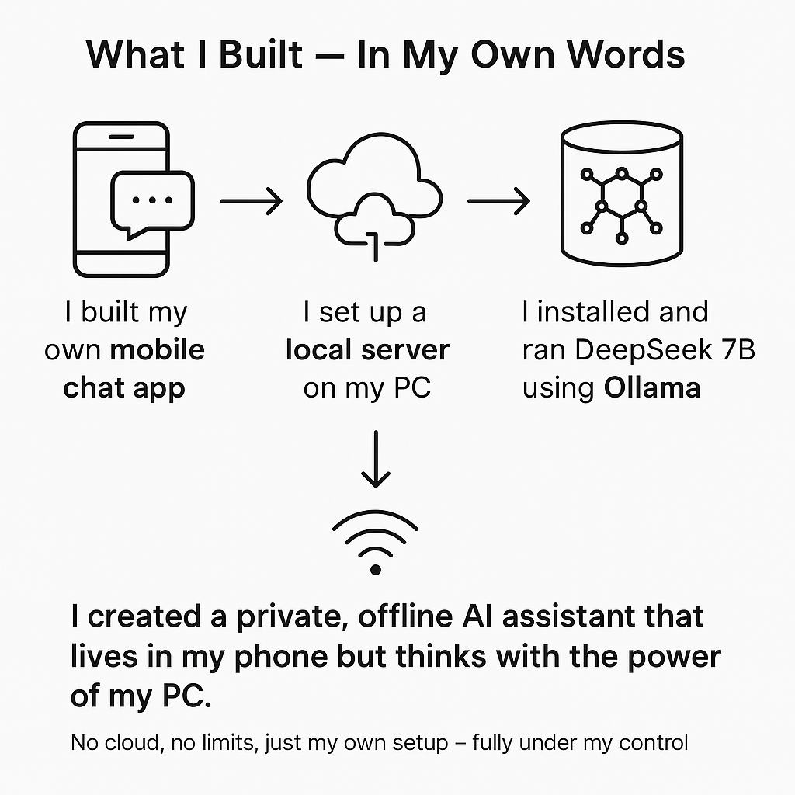

# Local LLM Assistant

A private, offline AI assistant that lives on your phone — powered by a local model running on your PC.  
No cloud, no data leaks, no limits. Just your own setup, fully under your control.

---

## What I Built

-  A **mobile chat app** using Flutter
-  A **FastAPI server** to handle chat requests
-  A local **DeepSeek 7B LLM** running with Ollama
-  Connected everything over **local Wi-Fi / hotspot**

---

##  How It Works

1. Phone app sends your message over local Wi-Fi
2. FastAPI server on your PC receives the message
3. Server forwards it to DeepSeek via Ollama
4. DeepSeek generates a reply and sends it back to your phone
 

